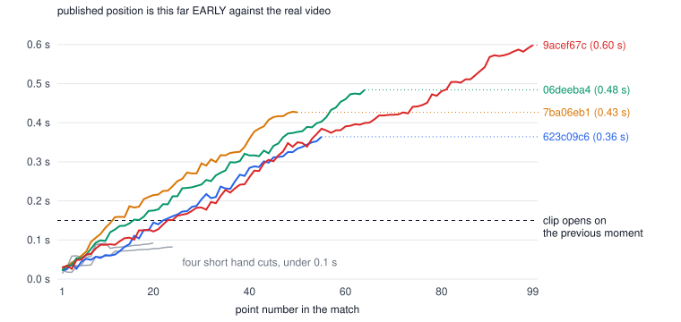

# Hand-cut clock: what drifted, and how to repair it

On the four long hand cuts (12 to 19 September, 50 to 99 points), 166 of
268 points play 0.2 to 0.6 s early: playback and clip files open on a
fraction of a second of the previous kept moment and stop that much before
their planned end, though no clip loses the end of its rally. The four
short hand cuts are off by under 0.1 s, which nobody can see. The repair
below puts every point on the cut video's measured clock (database and
match.json) and re-cuts the 223 clips that are off by 0.1 s or more
through the ordinary re-cut trigger; nothing has been run.



## Measured, 2026-09-25

"Early" is how far the published `cut_t0` sits before where the point's
footage really is in the cut video. It grows with every kept segment
because each separately encoded part comes out a few milliseconds longer
than planned (a last frame, an AAC packet): 7 to 26 ms a segment here.

| Match | Owner | Cut on | Points | Segments | Early, first point | middle | last | Points > 0.2 s | Clips that open on the previous moment | Clip loses its rally end |
| --- | --- | --- | --: | --: | --: | --: | --: | --: | --: | --- |
| 5e432cde | admin | Sep 8 | 3 | 3 | 0.01 s | 0.03 s | 0.04 s | 0 | 0 | no |
| 04f1b393 | admin | Sep 9 | 20 | 6 | 0.02 s | 0.08 s | 0.09 s | 0 | 0 | no |
| aae8e476 | admin | Sep 16 | 24 | 3 | 0.03 s | 0.07 s | 0.08 s | 0 | 0 | no |
| 4923bbef | admin | Sep 17 | 9 | 5 | 0.03 s | 0.06 s | 0.09 s | 0 | 0 | no |
| **623c09c6** | admin | Sep 12 | 55 | 52 | 0.02 s | 0.19 s | **0.36 s** | 26 | 31 (up to 0.21 s) | no |
| **7ba06eb1** | player | Sep 18 | 50 | 46 | 0.03 s | 0.26 s | **0.43 s** | 33 | 35 (up to 0.28 s) | no |
| **06deeba4** | player | Sep 18 | 64 | 56 | 0.02 s | 0.27 s | **0.48 s** | 41 | 41 (up to 0.33 s) | no |
| **9acef67c** | player | Sep 19 | 99 | 86 | 0.03 s | 0.35 s | **0.60 s** | 66 | 67 (up to 0.45 s) | no |

Picture readings. The re-run clock below agrees within a frame: the last
points of the four long matches come out 0.36, 0.42, 0.49 and 0.59 s early.
"admin" is the admin's own account; "player" is one other player, who has
a share link out on each of those three matches.

What a drifted point does, on each surface:

| Surface | Reads | Effect at 0.6 s early |
| --- | --- | --- |
| Match page, share page, Keep score (web and iOS) | `cut_t0` from the database, plays the cut video | Opens on ~0.45 s of the previous kept moment, then jumps; stops 0.6 s before its planned end, so the tail after the rally is 0.7 s instead of 1.3 s |
| Clip files `NN.mp4` (Starred, shared clips, coach review) | cut from the cut video at the published `cut_t0` | Same shift baked in. Checked frame by frame on 42 clips: every one still ends 0.71 to 1.31 s after the marked end of its rally |
| Automatic highlights, 623c09c6 (11 points) | cut-clock bounds from `cut_t0` | Up to 0.36 s early (point 55) |
| Starred reel, 9acef67c (6 points) | cut-clock bounds from `cut_t0` | 0.15 to 0.59 s early |
| Later re-cuts after an Adjust | `match.json`, which has no measured offsets | Would cut the same early window again |

Late clips, checked against the original (`clip_open.py`, `measure_drift.py --clips`):

| Clip | Early | Opens on | Ends after the marked rally end |
| --- | --: | --- | --: |
| 623c09c6 #53 | 0.35 s | 0.20 s of the previous segment, then its own footage | 0.96 s |
| 7ba06eb1 #48 | 0.43 s | 0.27 s of the previous segment | 0.86 s |
| 06deeba4 #64 | 0.48 s | 0.32 s of the previous segment | 0.83 s |
| 9acef67c #99 | 0.60 s | 0.47 s of the previous segment, from 8 s earlier in the match | 0.72 s |

### Three independent readings, and how far they agree

1. **Picture.** Every point was found twice in the published cut video: a
   0.2 s run of ORIGINAL frames (read by range over a presigned URL, never
   downloaded whole), 0.5 s into the rally and 0.3 s before its end, slid
   along the cut's frames within 3 s of the published position
   (`framematch.py`, `measure_drift.py`). Each kept segment was read once
   more, 0.5 s in.
2. **Keyframes.** The cut encodes a keyframe every 60 frames and restarts
   that count at every part, so a keyframe after a gap other than 60
   frames is where a part begins.
3. **Re-running the cut.** The hand lane's own `cmd_cut`, run again today
   on the original from the segments `match.json` stores, rebuilds the
   published cut video **byte for byte** (same SHA-256), and its measured
   part offsets are therefore the published file's clock to the
   microsecond. This is also exactly what the fixed worker publishes.

| Check | Result |
| --- | --- |
| Re-run cut identical to the published cut | all 8 hand cuts, SHA-256 identical, including the earliest (8 September) |
| Re-run clock against every picture reading | within 0.63 of a frame on all 648 readings (worst 21 ms at 30 fps, 10 ms at 60 fps) |
| A point's two picture readings | within 2.4 ms on six matches, within one frame (15 ms) on the other two |
| Picture against keyframe, per segment | within one frame on all 257 segments (254 unambiguous part boundaries) |
| Picture match cost (0 = identical frames) | at most 0.006 |

The encoder's frame-rate conversion moves a segment's mapping by one frame
here and there (04f1b393 segment index 4 reads one frame earlier 0.5 s in
than 2 to 15 s in), so one frame is the precision the picture method
claims, and the repair takes the median of every picture reading of a
segment when it has no re-run.

## The fix that stops new drift (commit 7adea47a, not deployed)

`process_hand_cut` now reconciles and reads back the `match.json` that
`cmd_cut` rewrites with the measured part offsets, exactly as the
automatic path does, so the published `cut_t0`, the clip encode windows,
the tripwire and the uploaded `match.json` all use the measured clock.
`worker/tests/test_hand_cut_clock.py` runs the Mac hand cut end to end
with parts that run long, through the real `cut_timeline` measurement
(five of its six tests fail on the old code). The re-run above is the same
`cmd_cut` on real footage, and its clock matches the picture readings.
**Until the hand lane runs a sealed release containing 7adea47a, every new
long hand cut drifts the same way.** A cut made on the iPhone was never
affected: the Mac publishes positions re-derived from the phone's own
measured offsets.

## The repair

### What it writes, per match

| Where | What | How |
| --- | --- | --- |
| R2 `points/<owner>/<match>/match.json` | adds `cut_segment_offsets` and `cut_timing` (`mp4-concat-measured-v1` with the re-run's SHA-256, or `frame-match-repair-v1`); every point's `cut_t0` on that clock; nothing else changes (checked field by field) | the worker's own `cut_timeline.apply`, the function a fixed hand cut uses; the previous file is saved first in the ops folder |
| `points.cut_t0` | every point of the match | one transaction, holding the match row lock every worker publication takes; each update guarded on id, version, `t0`, `t1` and the old `cut_t0`; the transaction aborts if any row moved |
| `points.edited = true` | the points off by 0.1 s or more (223 of 268 on the four long matches, none on the short ones) | the request the apps make for a re-cut: the `points_request_reclip` trigger queues one `reclip` job per match |
| Triggers, automatically | `timing_revision` + 1 on each point; `highlight_evidence` cleared where it changes | existing triggers on `points` |
| Re-cut job, automatically | a new clip `…/versions/<version>/NN-xxxxxxxx.mp4` per flagged point, cut from the cut video at the corrected position (checked: all 324 points land exactly on the new `cut_t0`), `clip_path` and a storage ledger row per clip, `edited` back to false | ordinary `process_reclip` |

Nothing touches `t0`, `t1`, winners, scores, the canonical score state, the
owner's timing observations (they are only invalidated when an edge
moves), the cut video or the original.

**Why not `adjust_point`.** It is the owner's edit: it needs the owner's
session, it moves `t0`/`t1`, and it re-anchors `cut_t0` relative to the
existing value, which is the value that is wrong. `cut_t0` here is a fact
the worker published about its own video; the correction is the worker's
own arithmetic over the measured clock, written the way a worker
publication writes it (row lock, guarded rows), plus the apps' own re-cut
request.

### Order and commands

Run from this folder in a checkout that contains it. `D` holds downloads
and measurements; `HC_REPAIR_OPS` (default
`~/Library/Caches/PongLens/hand-cut-clock-repair-20260925`) holds plans and
backups and survives a restart. Do 623c09c6 first (the admin's own match),
check it, then 7ba06eb1, 06deeba4, 9acef67c. The four short matches are
optional: steps 2 to 5 correct their `cut_t0` and `match.json` and re-cut
nothing.

```bash
cd docs/research/2026-09-25-hand-cut-clock
PY=/Users/adil/Desktop/Projects/PongLens/worker/venv/bin/python
D=/private/tmp/claude-501/hc-drift
M=623c09c6

# 1. Read-only: what is live now.
$PY -B inventory.py $D/inventory.json

# 2. Read-only: pictures (8 minutes for the 99-point match) and the re-run
#    (10 to 40 minutes a match at nice 19; it must print "IS").
$PY -B measure_drift.py $D/inventory.json $M --clips first:2,last:3,worst:3
$PY -B repair_hand_cut_clock.py timeline $D/inventory.json $M

# 3. Read-only: plan. Must print "clock from mp4-concat-measured-v1, 0 problem(s)".
$PY -B repair_hand_cut_clock.py plan $D/inventory.json $M

# 4. Prints every write, makes none.
$PY -B repair_hand_cut_clock.py apply $M --dry-run

# 5. WRITES: match.json, then one database transaction.
$PY -B repair_hand_cut_clock.py apply $M
```

6. Watch the re-cut (read-only SQL):
   ```sql
   select status, progress, error, updated_at from public.jobs
   where kind = 'reclip' and options->>'match_id' = '<match id>'
   order by created_at desc limit 1;

   select count(*) filter (where edited) as waiting,
          count(*) filter (where clip_path like '%/versions/%') as recut
   from public.points where match_id = '<match id>' and not deleted;
   ```
7. Verify, once `waiting` is 0: repeat step 1, delete `$D/$M/match.json`
   so the corrected file is fetched, and repeat the `measure_drift.py` line.
   Expected: every point early by at most one frame (±0.017 s), and each
   sampled re-cut clip opening within a frame of its `clip_t0` and closing within a
   frame of its `clip_t1`.
8. Highlights on 623c09c6: its reel now reads as out of date, and the
   match page offers to update it; press it from the admin account. The
   refresh reuses the saved ball tracking. The starred reel on 9acef67c
   re-renders the next time it is requested, because its stored bounds no
   longer match the points.

### Rollback

```bash
$PY -B repair_hand_cut_clock.py rollback $M --dry-run
$PY -B repair_hand_cut_clock.py rollback $M
```

Refuses while a re-cut is queued or running. In one transaction it puts
every `cut_t0` back, points `clip_path` at the original `NN.mp4` (a re-cut
never deletes an original) and clears `edited` so nothing re-cuts again;
then it restores `match.json` from the backup. The re-cut files stay in R2,
unreferenced, until deleted. A regenerated highlights reel is regenerated
again the same way.

### Risks worth knowing

| Risk | What happens | Handling |
| --- | --- | --- |
| Storage | The 223 re-cut clips add 675 MB (623c09c6 100 MB, 7ba06eb1 136, 06deeba4 171, 9acef67c 267); the original `NN.mp4` files stay | Optional cleanup after step 7: delete only originals no point or reel references. Deleting a player's files needs its own yes |
| Owner editing at the same moment | The guarded transaction aborts; `match.json` is already corrected, which is harmless (re-cuts then use the right clock) | Plan and apply again |
| An app with the match already open | It keeps playing the old windows until it reloads; an Adjust from it re-anchors from the corrected database value | None needed |
| Highlights on 623c09c6 | Shows "update" until pressed | Step 8 |
| Timing observations | Each point's `timing_revision` moves by one; the owner's 648 observations stay valid. Only `publish_hand_cut_v2` writes them, so nothing adds a second pair | None needed |
| Re-cut queue | Four jobs, 223 clips, a few seconds each | One match at a time |
| CPU during step 2 | The re-run encodes the kept footage again on the Mac Studio | It runs at nice 19; production workers keep priority |

## Files

| File | What |
| --- | --- |
| `framematch.py` | decode to small grey frames with their own timestamps; slide a run of frames to find it |
| `measure_drift.py` | per match: every segment, two readings per point, optional clip ends |
| `clip_open.py` | what a drifted clip opens on |
| `summarise.py`, `measurements.json`, `drift_chart.py`, `drift.svg` | the tables and chart above |
| `inventory.py` | the read-only query behind every step (the query was run through the Supabase MCP; this wrapper was not) |
| `repair_hand_cut_clock.py` | timeline (re-run), plan (read-only), apply, rollback. `timeline` and `plan` were run on all eight; `apply` only with `--dry-run`; `rollback` never |
| `r2ro.py` | read-only R2 access for the scripts above |

## Run (2026-09-25)

| Match | Re-run is the published cut | Points moved | Clips re-cut | After: max drift, all points |
| --- | --- | --: | --: | --: |
| 623c09c6 | yes | 55 | 40 | 0.007 s |
| 7ba06eb1 | yes | 50 | 43 | 0.009 s |
| 06deeba4 | yes | 64 | 55 | 0.009 s |
| 9acef67c | yes | 99 | 85 | 0.010 s |

All four planned from `mp4-concat-measured-v1` with 0 problems; `match.json` backups are under `~/Library/Caches/PongLens/hand-cut-clock-repair-20260925/<match>/match.json.before`. The re-cuts ran on the ordinary reclip path (fast lane) in 2 to 4 minutes a match. The four short hand cuts were left as they are (under 0.1 s). New hand cuts publish on the measured clock since hand-lane release 3 (`20d1aaa7`). Not yet done: the highlights reel on 623c09c6 still uses the old bounds until it is updated from the match page.
