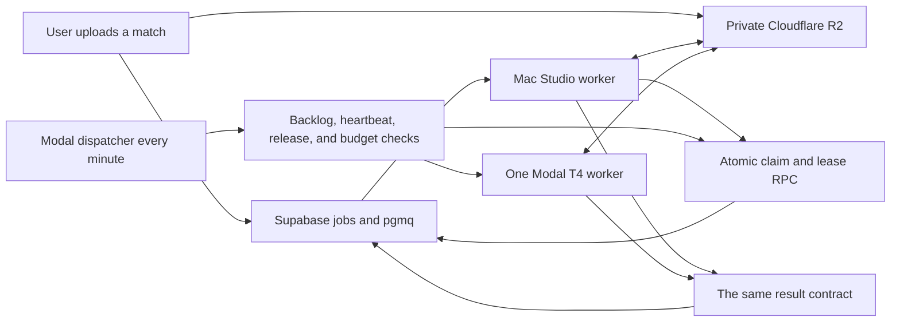

# Modal backup worker: one pipeline in two places

**Date:** 2026-09-04
**Status:** Approved direction; implementation plan pending review

## Purpose

PongLens will keep the Mac Studio as its normal video-processing worker and
use Modal only when the Mac has accumulated too much work or is unavailable.
The cloud worker is capacity insurance, not a second product and not the
default route for uploads.

The most important requirement is that an upload receives the same PongLens
processing pipeline whichever machine runs it. The Mac and Modal may use
different hardware acceleration, but they must run the same released source,
models, settings, and output contract. A worker whose release does not match
the active production release is not allowed to claim a job.

This document specifies the architecture and operating rules. It does not
implement them.

## Decisions

- The Mac Studio remains the primary worker.
- Modal is the overflow and outage worker.
- Modal starts at one T4 GPU worker and never processes more than one customer
  video at a time.
- The first cloud-capable job is an R2-backed `deadspace_cut`, including its
  selected points and placement stages.
- YouTube download jobs and the smaller auxiliary job kinds stay on the Mac in
  the first release.
- A scheduled Modal dispatcher checks demand once per minute. Cloudflare stays
  the video store and Supabase stays the database and job queue.
- Automatic overflow starts when the Mac's projected unfinished work exceeds
  12 hours. An outage path starts when the Mac heartbeat is at least 15 minutes
  old and the oldest eligible upload has waited at least 30 minutes.
- Every cloud claim is also subject to release parity and budget checks.
- The application reserves $1.50 of cloud budget before dispatching one job.
  It stops new cloud work at $3 per day or $20 per billing month. The provider
  account keeps a separate hard usage limit of $25–$30 and a net spend limit
  of $0 or $1.
- If cloud processing is unavailable or the budget is exhausted, the upload
  waits for the Mac. It does not fail for the user.

## What the worker does today

The production daemon in `worker/worker.py` reads the Supabase `pgmq` queue,
claims a row in `public.jobs`, downloads the input, runs the pipeline, uploads
the output, publishes match metadata and clips, updates the database, and
sends the ready notification. For a normal match upload the important stages
are:

1. Download the source video from private Cloudflare R2 storage.
2. Read video duration, frame rate, dimensions, and any requested trim.
3. Run the content and broadcast-footage gates.
4. Run BlurBall inference over the video.
5. When points are requested, find the table and point boundaries, calculate
   placement when requested, and prepare point metadata and clips.
6. Cut dead time from the match.
7. Upload the cut video, metadata, clips, thumbnails, and diagnostics to R2.
8. Publish the corresponding database rows and mark the job ready.
9. Run the existing post-ready side-change work and notifications.

The code is not presently a self-contained deployable unit. `worker.py` and
`points_pipeline.py` live in PongLens, but production also depends on:

- the BlurBall wrapper, repository, Python environment, and weights under the
  separate TTVid workspace;
- the table-keypoint source, environment, and weights under local model/cache
  directories;
- the RTMPose ONNX model and environment under a local cache directory;
- FFmpeg and FFprobe installed on the Mac;
- environment flags which may be supplied outside the repository.

The current worker also logs the latest Git commit as its code version, even
though it may be running uncommitted source. That is useful diagnostics but is
not a sufficient release identity. Hand-copying these pieces to Modal would
create two pipelines that drift whenever the model is optimized.

### Observed production baseline

The investigation on 2026-09-04 found this concrete dependency baseline. It
records what must be brought under release control; it is not a promise that
these hashes stay current after the next model release.

- BlurBall repository commit:
  `2f0f5496f7ba4b5b1a36790749935121b2ce972d`
- BlurBall wrapper SHA-256:
  `cb2e1af40792d9379e6a1fd86843671a4abb93239e8b7be7a4a6c18a9aa9f781`
- BlurBall weights SHA-256:
  `3545206c7155194ea654899d33579c88c9fd8e82c632cbdbae3b0c0ec3f2985f`
- table-keypoint weights SHA-256:
  `d7deef52395949ac1d013ad86ca6335166fd1edd8ff090896562f86c0a084394`
- RTMPose ONNX SHA-256:
  `5c0a4bf67953e6d2ac43ce15e77dc9d5d354ae18430a47d2c5963a7bc5683e3c`

The current BlurBall wrapper offers `mps` and `cpu`, but no CUDA device. A
CUDA-capable execution path is therefore required before Modal can run the
same detector efficiently. It must be added to the shared wrapper rather than
implemented as a separate cloud-only detector.

## The non-negotiable parity rule

There is one production pipeline release with two execution locations:

- `mac`: Apple silicon, using the supported Mac acceleration path;
- `modal`: Linux with an NVIDIA GPU, using the supported CUDA path.

“The same pipeline” means the same:

- PongLens worker and pipeline source;
- BlurBall source, wrapper, and checkpoint;
- table-keypoint source and checkpoint;
- RTMPose source and checkpoint when that stage is enabled;
- pipeline-affecting feature flags and thresholds;
- pinned Python dependencies and compatible FFmpeg behavior;
- stage order, failure/refusal rules, metadata schema, and output contract.

It does not mean that MP4 files or floating-point model values must be
byte-for-byte identical. MPS and CUDA, and different FFmpeg builds, can produce
small numerical or encoding differences. Parity is judged by the semantic
result: the same gates, materially equivalent point boundaries and cut spans,
the same placement status, and the same required output set.

Any change to worker behavior is incomplete until one release containing that
change has passed parity checks and is installed in both locations. There is
no supported “Mac now, cloud later” release. The TTVid checkout may remain a
research workspace, but mutable files from that checkout must no longer be the
production source of truth.

## Pipeline release manifest

Each deployable release receives an immutable `pipeline_release_id` and a
manifest containing at least:

- PongLens Git commit and a digest of the packaged worker source;
- BlurBall upstream commit, wrapper digest, and weights SHA-256;
- table-keypoint source digest and weights SHA-256;
- RTMPose model digest when enabled;
- Python version and locked dependency digests for each platform;
- FFmpeg and FFprobe versions;
- every pipeline-affecting environment value, including content-check,
  placement, calibration, cut, and model-selection flags;
- output schema version and database migration compatibility;
- build time and release author.

Secrets are referenced by name but never included in the manifest. Model
weights remain private and are verified against the manifest before a worker
reports itself ready.

The manifest separates behavioral identity from platform packaging. Mac and
Modal may have different dependency lock files where native wheels differ, but
both locks belong to the same release and must implement the same behavior.

## Architecture

The dispatcher runs as a small scheduled Modal function. It does not process
video. It reads only the state required to decide whether one cloud job may be
started, atomically claims that job, and uses Modal's durable asynchronous
invocation to start the video function. Modal functions scale to zero while
idle, and the Starter plan includes scheduled functions. See Modal's
[function](https://modal.com/docs/guide/functions) and
[schedule](https://modal.com/docs/guide/cron) documentation.

The video function receives only a job ID, lease token, and expected release
ID. It downloads the source from R2 to ephemeral disk, executes the shared
pipeline, uploads the results, and lets the container disappear. Customer
videos are not retained in a persistent Modal volume.

## Eligible work

The first cloud release may claim a job only when all of these are true:

- `kind = 'deadspace_cut'`;
- status is `queued` and the job has no live lease;
- the input is in R2 rather than legacy Supabase Storage;
- the job fits the existing 45-minute and 2 GB product limits;
- its options are supported by the active cloud release;
- the active release, Mac release, and Modal release IDs match;
- the budget reservation succeeds.

Points and placement are not separate optional cloud implementations. If the
upload requested them, the cloud worker runs the same stages as the Mac. A
model which cannot lawfully or technically be put in Modal blocks cloud
launch; the worker must not quietly omit that stage and return a lesser result.

The following remain Mac-only initially:

- `youtube_import`, because the existing residential download path is more
  reliable than a data-centre IP;
- `content_check`, `placement_generate`, `placement_retry`, `reclip`, and
  `reel` auxiliary jobs;
- legacy inputs not already stored in R2.

Those kinds can be added later only by extending this same release, lease,
budget, and parity system.

## Safe job ownership

The present update from almost any non-cancelled status to `processing` is not
safe once two workers exist. A database migration will introduce explicit
lease ownership and one transaction-safe claim function.

The job/execution data must record:

- execution lane: `mac` or `modal`;
- worker identity;
- lease token and lease expiry;
- pipeline release ID;
- attempt number and provider invocation ID;
- claim, start, heartbeat, finish, and failure times;
- estimated work, reserved budget, and measured compute cost.

Both workers use the same security-definer claim RPC. It may move a job from
`queued` to `processing` only if no valid lease exists. It returns a unique
lease token, and all later progress, completion, failure, and cancellation
writes must present that token. A background heartbeat renews the lease during
long stages.

The Mac may still read the existing `pgmq` message first. If the claim RPC says
that Modal already owns or completed the job, the Mac archives that stale
message and does no work. Cloud recovery which returns an expired job to the
queue must also create a fresh `pgmq` message if the original was archived.

Cancellation and claiming are mutually exclusive database transactions. A
queued job can be cancelled; a claimed job follows the product's existing
processing-cancellation behavior. No check-then-update race is allowed.

## Dispatch policy

The decision uses projected Mac queue time, not CPU percentage. High CPU while
processing a video is normal and is not itself overload.

For every eligible queued upload, the app stores an estimated amount of Mac
work based on measured history. The first estimator uses:

- source duration;
- frame rate, with 60 FPS initially weighted at roughly twice 30 FPS;
- resolution where measurements show it matters;
- whether points and placement are requested;
- recent stage timing from completed jobs on the active release.

At every scheduled check, remaining time for the Mac's current job is added to
the estimates of the eligible jobs waiting behind it.

One job may be dispatched to Modal when either condition holds:

1. projected unfinished Mac work exceeds 12 hours; or
2. the Mac heartbeat is older than 15 minutes and the oldest eligible job has
   waited at least 30 minutes.

It must still remain local when any of these hold:

- a Modal video job is already running;
- release IDs or model checksums do not match;
- the daily, monthly, or provider budget would be exceeded;
- the job is not cloud-eligible;
- the cloud release has failed its health check.

Jobs are selected oldest-first among eligible uploads. The system does not
promise that the most expensive or newest job will jump the queue.

## Cost controls

The Modal function starts with one T4 GPU, two physical CPU cores, 8 GiB of
memory, and enough ephemeral disk for the source plus intermediate and final
files. The exact CPU, memory, and disk values may be tuned after measurement,
but GPU concurrency stays at one through the first production phase.

At the price verified on 2026-09-04, a T4 is $0.000164 per second, plus CPU and
memory. Modal bills actual resource time and idle functions scale to zero;
the Starter plan includes $30 of monthly compute credit. Current rates remain
an estimate and the live [Modal pricing page](https://modal.com/pricing) is the
billing authority.

Three independent controls apply:

1. **Per job:** reserve $1.50 before dispatch and set a two-hour execution
   timeout. The planning estimate for a 45-minute, 60 FPS upload remains about
   $0.50–$1.00, but measurement decides future coefficients.
2. **Application:** allow at most $3 of reservations per UTC day and $20 per
   Modal billing cycle. Reservations are released or reconciled to measured
   cost after the attempt.
3. **Provider:** keep the Modal workspace usage limit at $25–$30 and the net
   out-of-pocket spend limit at $0 or $1. Modal distinguishes gross usage from
   charges after credit and stops workloads when the applicable cap is hit;
   see [Modal budgets](https://modal.com/docs/guide/budgets).

The application limit is lower than the provider limit so one job can finish
without the provider abruptly stopping it. The existing platform-cost system
records Modal compute seconds with lane, job, attempt, and release metadata;
the Modal dashboard/invoice remains the final billing truth.

No automatic application retry is configured for the video function. Modal
can reschedule crashed containers, so every stage and publication step must be
idempotent even without an explicit retry count. This follows Modal's documented
[container crash behavior](https://modal.com/docs/guide/retries).

## Failure and publication rules

- Intermediate cloud files use an attempt-specific temporary prefix.
- Public result paths are written only after the complete expected output set
  exists and the lease is still owned by that attempt.
- Database publication is idempotent by job, attempt, stage, and release.
- A lost worker stops renewing its lease. Recovery marks the attempt abandoned,
  removes temporary objects on the retention schedule, and returns the job to
  the Mac queue unless an operator explicitly retries it in Modal.
- A late worker with an expired lease cannot publish or mark a job complete.
- A cloud timeout or capacity error is operational detail, not a user-facing
  processing failure. The user continues to see a queued estimate.
- A genuine deterministic pipeline refusal has the same user result on both
  lanes and is not retried merely by changing machines.

## Release, promotion, and rollback

Production changes follow one path:

1. Build a candidate manifest from committed, clean source and private,
   checksum-verified model artifacts.
2. Build both platform packages from that manifest. The Mac package installs
   into a versioned directory; the Modal package builds an immutable image.
3. Run unit, integration, and short parity fixtures on both.
4. Deploy the candidate cloud image without making it eligible for customer
   jobs.
5. Install the matching candidate on the Mac and run production canaries.
6. Promote one `pipeline_release_id` in Supabase. Both workers must report that
   exact ID before cloud dispatch becomes healthy.
7. Keep the prior complete release available on both platforms for rollback.

Rollback means reactivating one prior release in both locations. Patching the
Mac checkout or a live Modal container is not a release method. A developer or
agent changing BlurBall, table detection, cut behavior, dependencies, or a
pipeline feature flag must update the manifest and parity fixtures in the same
change.

The current external BlurBall wrapper should move into the PongLens-owned
release source or be imported as an explicitly pinned dependency. Production
must never execute a mutable research file by absolute path. All runtime paths
become environment-driven and validated at startup.

## Parity tests and acceptance thresholds

The release suite contains at least:

- a short 30 FPS match;
- a normal points-and-placement match;
- a 45-minute, 60 FPS upper-bound fixture or a representative segmented
  equivalent for routine CI plus a full pre-release run.

Mac and Modal results are compared for:

- content and broadcast gate decisions;
- stage success, refusal, and fallback decisions;
- point count and point-boundary timing within an agreed frame/second tolerance;
- cut spans and final duration within an encoding tolerance;
- table-calibration and placement status, plus bounded coordinate differences;
- required clips, thumbnails, JSON, diagnostics, and database records;
- output schemas and user-visible readiness state.

The implementation plan must set numeric tolerances from current fixture
variance before automatic customer dispatch is enabled. Byte equality is not
an acceptance criterion.

Concurrency and recovery tests must prove:

- simultaneous Mac and Modal claims yield exactly one owner;
- cancellation and claim races have one valid outcome;
- a lease is renewed during long processing and recovered after death;
- an expired attempt cannot publish;
- repeated publication does not duplicate points, clips, or cost rows;
- release mismatch, missing models, and checksum mismatch prevent readiness;
- budget reservation is atomic and caps cannot be oversubscribed;
- killing Modal during each major stage safely returns the job to the Mac;
- the maximum fixture remains inside timeout, disk, and planned cost bounds.

## User estimates

File size mainly controls upload time. Duration, frame rate, resolution, and
selected analysis control processing time. The product should not show a
single optimistic number before it knows those facts.

The displayed estimate has three parts:

1. upload time remaining, calculated from the user's observed connection;
2. estimated work already ahead in the shared queue;
3. estimated processing time for this video after metadata is read.

The UI rounds this to honest windows such as “later today” or “tomorrow,” and
continues to promise an email when the match is ready. It is an estimate, not
a service-level guarantee. Existing public copy saying processing is typically
under 30 minutes must be replaced before a larger public launch.

## Secrets, privacy, and licensing

Runtime credentials are stored as Modal Secrets and exposed only to the
functions which need them. The set includes a restricted Supabase/Postgres
credential, least-privilege R2 credentials, and the existing OpenAI and Resend
credentials required by shared stages. The Modal deployment token remains on
the operator's Mac and is not a runtime secret. Modal documents encrypted
secret injection in its [Secrets guide](https://modal.com/docs/guide/secrets).

Before any customer video is processed in Modal:

- the privacy policy must say that overflow video processing may occur on
  Modal-managed cloud infrastructure;
- Modal must be added to the service-provider list and the applicable data
  processing terms reviewed;
- retention and regional requirements must be selected deliberately;
- R2 and database credentials must be restricted to the objects and operations
  required by the worker;
- logs must never contain signed URLs, credentials, or video contents.

Modal publishes a [Data Processing Addendum](https://modal.com/legal/dpa), but
using it does not remove PongLens's duty to update its own disclosure.

The table-keypoint implementation currently uses GPL-licensed source and
weights whose separate license is not stated in the local model directory.
Before packaging it for third-party cloud execution, the rights and required
notices must be reviewed and `THIRD_PARTY_LICENSES.md` updated. This is a
release gate, not permission to disable table detection in Modal. This design
is an engineering requirement, not legal advice.

## Observability and operator controls

The admin view must show:

- Mac and Modal heartbeat, health, release ID, and model checksum status;
- current Mac queue estimate and the reason cloud is or is not eligible;
- the active job's lane, attempt, lease age, stage, and progress;
- daily/monthly cloud reservations and measured cost;
- recent cloud failures, recoveries, and release mismatches;
- controls to disable cloud dispatch globally and to dispatch one eligible
  canary manually.

Every structured worker log includes job ID, attempt ID, lane, worker identity,
release ID, and stage. Alerts fire for an expired active lease, repeated cloud
crashes, parity mismatch, a missing Mac heartbeat, and budget exhaustion.

## Rollout

1. **Package and measure:** create the release manifest, portable runtime,
   leases, instrumentation, and fixtures without processing customer data in
   Modal.
2. **Parity canaries:** run operator-owned fixtures on Mac and Modal and settle
   tolerances and performance coefficients.
3. **Manual overflow:** after privacy and licensing gates, allow an operator to
   send one eligible customer upload to Modal. Concurrency remains one.
4. **Automatic overflow:** enable the 12-hour backlog and outage rules only
   after at least 20 successful cloud customer runs, no unresolved duplicate
   claims or publications, and an explicit operator approval.
5. **Tune, do not broaden:** update time/cost estimates from evidence. New job
   kinds or greater concurrency require a separate reviewed change.

## Non-goals

- Replacing the Mac Studio with cloud-first processing.
- Promising same-day, six-hour, or 20-minute processing.
- Building a second cloud-specific analysis pipeline.
- Moving YouTube downloads to Modal in the first release.
- Increasing cloud concurrency automatically when Reddit traffic grows.
- Treating Modal's monthly credit as permission to exceed application budgets.
- Making model weights or customer videos public.

## Acceptance criteria

The backup integration is ready for automatic customer use only when:

- one immutable release can be built and identified on both Mac and Modal;
- neither worker accepts cloud-eligible work when releases differ;
- all current stages requested by a cloud job run in both locations;
- atomic leases prevent duplicate work and stale publication;
- recovery returns interrupted cloud work safely to the Mac;
- one-worker, timeout, daily, monthly, and provider cost controls are active;
- the required parity, race, recovery, and upper-bound fixtures pass;
- privacy, service-provider, and third-party-license documentation is updated;
- the operator can see health, lane, release, backlog, and budget state;
- 20 manual cloud runs meet the agreed correctness and cost bounds before the
  automatic trigger is switched on.
